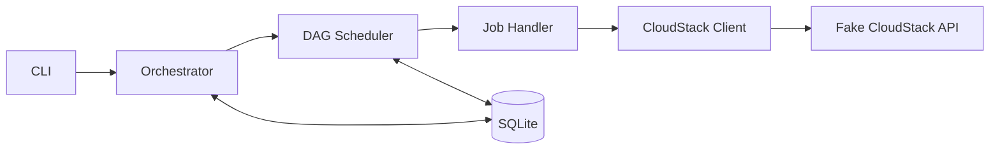
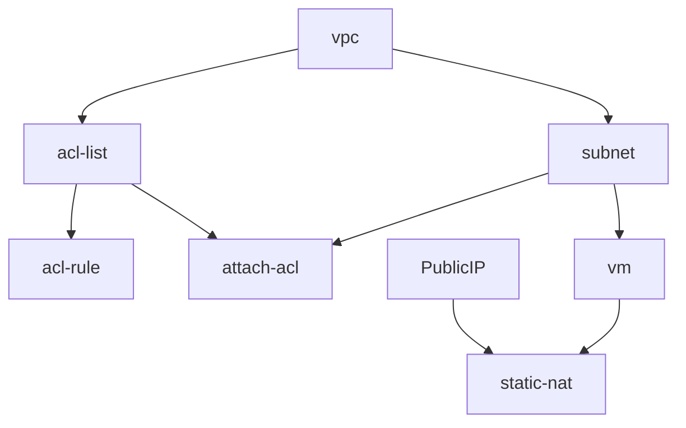

# Deployment Job Orchestrator

POC TypeScript untuk menjalankan deployment sebagai kumpulan job yang saling bergantung.

Proyek ini menggunakan DAG untuk menentukan urutan job, menjalankan job independen secara paralel, menyimpan seluruh status ke SQLite, melakukan retry, dan menjalankan rollback ketika terjadi kegagalan.

Contoh bawaan mensimulasikan deployment VM melalui Fake CloudStack API.

## Menjalankan proyek

Persyaratan: Node.js 24.18.0 atau lebih baru.

```bash
npm i
npm run cli
```

Konfigurasi URL Fake CloudStack API berada di `.env`:

```env
CLOUDSTACK_API_URL=
```

CLI bersifat interaktif:

- Panah atas/bawah untuk memilih.
- `Enter` untuk melanjutkan.
- `Esc` untuk kembali.
- `q` untuk keluar.

Menu CLI dapat membuat job run baru, melanjutkan job run yang terputus, dan mereset riwayat database.

Database persisten berada di:

```text
src/database/__generated__/deployments.sqlite
```

## Video tutorial

[▶️ Tonton video tutorial](./tutorial.mp4)

## Cara kerja

Ketika sebuah case dipilih, aplikasi akan:

1. Membaca array logical step ID dari SQLite.
2. Membuat DAG dari dependency pada combined deployment-step registry.
3. Menggabungkan DAG dengan input case JSON dan meng-expand named instances.
4. Membuat satu `job run` dengan ID unik.
5. Menjalankan job yang dependency-nya sudah berhasil.
6. Menyimpan setiap perubahan status ke SQLite.
7. Melakukan retry jika job gagal.
8. Melakukan rollback jika retry habis.



## DAG deployment

Deployment dengan public IP memiliki alur berikut:



`public-ip` tidak memiliki dependency sehingga dapat langsung berjalan. Setelah `vpc` selesai,
`subnet` dan `acl-list` dapat berjalan bersamaan. `attach-acl` menunggu `subnet` dan
`acl-list`, tanpa menunggu `acl-rule`.

Deployment tanpa public IP tidak menjalankan node `public-ip` dan `static-nat`.

## Case demo

Case berada di `src/interfaces/cli/cases`.

| File | Skenario |
|---|---|
| `01.without-public-ip.json` | Deployment VM tanpa public IP. |
| `02.with-public-ip.json` | Deployment VM dengan public IP dan static NAT. |
| `03.slow-subnet.json` | Subnet lambat, tetapi cabang ACL tetap berjalan. |
| `04.failed-job.json` | ACL rule gagal, di-retry, lalu deployment di-rollback. |
| `05.parallel-acl-rules.json` | Lima ACL rule di-expand dari satu logical step dan berjalan paralel. |

Nilai yang sama untuk semua step dapat diletakkan di `defaults`. `apiControl` dan `config`
pada sebuah step akan meng-override bagian yang diperlukan:

```json
{
  "defaults": {
    "apiControl": { "delay": 0, "timeout": 0, "result": 1 },
    "config": { "maxRetries": 1 }
  },
  "steps": {
    "acl-rule": {
      "input": { "protocol": "tcp" },
      "apiControl": { "result": 2 },
      "config": { "maxRetries": 2 }
    }
  }
}
```

Pada contoh tersebut, `acl-rule` tetap mewarisi `delay` dan `timeout`, tetapi mengganti
`result` serta jumlah retry. `apiControl` mendukung:

- `delay`: waktu tunggu simulasi.
- `timeout`: batas tunggu simulasi.
- `result: 1`: request berhasil.
- `result: 2`: request gagal.

Step `acl-rule` juga mendukung named instances. Template database tetap memiliki satu
logical ID `acl-rule`, sedangkan resolver membuat runtime job terpisah untuk setiap instance:

```json
{
  "steps": {
    "acl-rule": {
      "instances": {
        "ssh": { "input": { "protocol": "tcp", "startPort": 22, "endPort": 22 } },
        "http": { "input": { "protocol": "tcp", "startPort": 80, "endPort": 80 } }
      }
    }
  }
}
```

Contoh tersebut menghasilkan runtime ID `acl-rule:ssh` dan `acl-rule:http`. Keduanya memakai
type `acl-rule`, berjalan paralel setelah `acl-list`, serta memiliki status dan retry sendiri.
Fan-out dibatasi sebagai leaf: step lain tidak boleh bergantung pada logical step tersebut.

## Retry dan rollback

`config.maxRetries` adalah jumlah percobaan tambahan setelah attempt pertama.

```text
maxRetries = 0 → maksimal 1 attempt
maxRetries = 1 → maksimal 2 attempts
maxRetries = 2 → maksimal 3 attempts
```

Jika semua retry gagal:

- Job yang belum berjalan menjadi `SKIPPED`.
- Job yang sedang berjalan dibatalkan.
- Job yang sudah `SUCCESS` di-rollback dalam urutan terbalik.
- Status akhir menjadi `ROLLED_BACK` atau `ROLLBACK_FAILED`.

Job tanpa implementasi rollback menjadi `ROLLBACK_SKIPPED`.

Job run berstatus `RUNNING` atau `ROLLING_BACK` dapat dilanjutkan dari menu CLI. Step yang sudah berhasil tidak dijalankan ulang. Jika proses terputus ketika sebuah request masih berjalan, step tersebut dijalankan sebagai attempt baru.

Setiap attempt memiliki timeout global, dengan nilai default 30 detik. Timeout menghentikan client menunggu, tetapi tidak menjamin operasi remote sudah berhenti.

## Request CloudStack

Folder `src/requests` berisi:

- `client.ts`: mengirim HTTP request dan melakukan polling asynchronous job.
- `deployment-steps.ts`: registry gabungan dependency, mode eksekusi, `run`, dan `rollback`.
- `api/*.ts`: satu command per file beserta metadata operasi, query, props, dan result.
- `api/commands.ts`: metadata command yang disusun dari constant milik setiap file API.

Request utama yang digunakan antara lain `createVpc`, `createNetwork`, `createNetworkACLList`,
`deployVirtualMachine`, `destroyVirtualMachine`, dan `enableStaticNat`.

Metadata operasi API (`command` dan opsional `resultKey`) tetap berada di file API. Metadata DAG
dan implementasi step digabung dalam registry dengan logical step ID sebagai key. Kolom
`jobs.definition` hanya menyimpan array logical step ID seperti berikut:

```json
["vpc", "subnet", "acl-list", "acl-rule", "attach-acl", "vm"]
```

`buildApiJobGraph` mengambil deployment step untuk setiap ID dari registry, memvalidasi dependency,
larangan dependent pada fan-out leaf, dan cycle, lalu menghasilkan urutan topologis untuk scheduler.

## Penyimpanan data

SQLite memiliki tiga tabel utama:

| Tabel | Isi |
|---|---|
| `jobs` | Template berupa array logical step ID; DAG dibuat dari combined registry. |
| `job_runs` | Satu eksekusi deployment dan snapshot job-nya. |
| `job_run_logs` | Histori status, attempt, result, dan error setiap job. |

Log bersifat append-only. Status terbaru sebuah job diperoleh dari log terakhir untuk pasangan `job_run_id` dan `job_id`.

Migrasi dijalankan otomatis ketika aplikasi membuka database.

## Struktur proyek

```text
src/
├── core/
│   ├── api-job-graph.ts      membangun dan memvalidasi DAG dari step registry
│   ├── job-definition.ts     menggabungkan DAG dan konfigurasi case
│   ├── job-executor.ts       eksekusi, retry, timeout, dan rollback satu job
│   ├── scheduler.ts          penjadwalan node DAG
│   ├── rollback.ts           urutan rollback deployment
│   └── deployment-orchestrator.ts facade utama
├── database/
│   ├── __generated__/        database SQLite
│   ├── migrations/           skema dan seed data
│   └── store.ts              akses dan penyimpanan data
├── interfaces/cli/
│   ├── cases/                case demo
│   └── app.tsx               tampilan dan entry point CLI
└── requests/
    ├── api/                  satu file per command beserta query, props, dan return type
    ├── client.ts             HTTP client bersama
    └── deployment-steps.ts   metadata DAG beserta run/rollback CloudStack

__test__/                    unit dan integration test
```

## Script

| Perintah | Kegunaan |
|---|---|
| `npm run cli` | Menjalankan CLI. |
| `npm run build` | Mengompilasi TypeScript. |
| `npm run typecheck` | Memeriksa tipe. |
| `npm test` | Menjalankan seluruh test. |

Reset database hanya menghapus `job_runs` dan `job_run_logs`. Definisi job, skema, dan migrasi tetap dipertahankan.

## Batasan POC

- Menggunakan Fake CloudStack API, bukan production.
- Tidak memiliki autentikasi CloudStack.
- Tidak memiliki retry backoff.
- Melanjutkan request yang terputus dapat mengulang operasi remote; sistem production memerlukan rekonsiliasi resource.
- Gunakan satu proses aktif untuk satu file SQLite.
