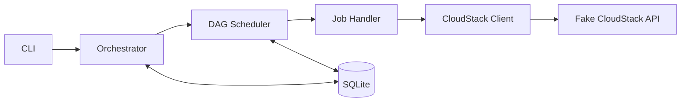
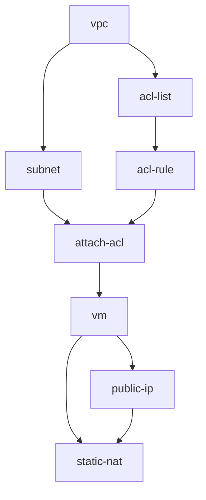

# Deployment Job Orchestrator

POC TypeScript untuk menjalankan deployment sebagai kumpulan job yang saling bergantung.

Proyek ini menggunakan DAG untuk menentukan urutan job, menjalankan job independen secara paralel, menyimpan seluruh status ke SQLite, melakukan retry, dan menjalankan rollback ketika terjadi kegagalan.

Contoh bawaan mensimulasikan deployment VM melalui Fake CloudStack API.

## Menjalankan proyek

Persyaratan: Node.js 24.18.0 atau lebih baru.

```bash
npm i
npm run cli
```

Konfigurasi URL Fake CloudStack API berada di `.env`:

```env
CLOUDSTACK_API_URL=
```

CLI bersifat interaktif:

- Panah atas/bawah untuk memilih.
- `Enter` untuk melanjutkan.
- `Esc` untuk kembali.
- `q` untuk keluar.

Menu CLI dapat membuat job run baru, melanjutkan job run yang terputus, dan mereset riwayat database.

Database persisten berada di:

```text
src/database/__generated__/deployments.sqlite
```

## Video tutorial

[▶️ Tonton video tutorial](./tutorial.mp4)

## Cara kerja

Ketika sebuah case dipilih, aplikasi akan:

1. Membaca definisi job dari SQLite.
2. Menggabungkannya dengan input case JSON.
3. Membuat satu `job run` dengan ID unik.
4. Menjalankan job yang dependency-nya sudah berhasil.
5. Menyimpan setiap perubahan status ke SQLite.
6. Melakukan retry jika job gagal.
7. Melakukan rollback jika retry habis.



## DAG deployment

Deployment dengan public IP memiliki alur berikut:



Setelah `vpc` selesai, `subnet` dan `acl-list` dapat berjalan bersamaan. `attach-acl` menunggu kedua cabang tersebut selesai.

Deployment tanpa public IP berhenti setelah `vm`.

## Case demo

Case berada di `src/interfaces/cli/cases`.

| File | Skenario |
|---|---|
| `01.without-public-ip.json` | Deployment VM tanpa public IP. |
| `02.with-public-ip.json` | Deployment VM dengan public IP dan static NAT. |
| `03.slow-subnet.json` | Subnet lambat, tetapi cabang ACL tetap berjalan. |
| `04.failed-job.json` | ACL rule gagal, di-retry, lalu deployment di-rollback. |

`apiControl` di dalam case digunakan untuk mengatur respons Fake CloudStack API:

- `delay`: waktu tunggu simulasi.
- `result: 1`: request berhasil.
- `result: 2`: request gagal.

## Retry dan rollback

`maxRetries` adalah jumlah percobaan tambahan setelah attempt pertama.

```text
maxRetries = 0 → maksimal 1 attempt
maxRetries = 1 → maksimal 2 attempts
maxRetries = 2 → maksimal 3 attempts
```

Jika semua retry gagal:

- Job yang belum berjalan menjadi `SKIPPED`.
- Job yang sedang berjalan dibatalkan.
- Job yang sudah `SUCCESS` di-rollback dalam urutan terbalik.
- Status akhir menjadi `ROLLED_BACK` atau `ROLLBACK_FAILED`.

Job tanpa implementasi rollback menjadi `ROLLBACK_SKIPPED`.

Job run berstatus `RUNNING` atau `ROLLING_BACK` dapat dilanjutkan dari menu CLI. Step yang sudah berhasil tidak dijalankan ulang. Jika proses terputus ketika sebuah request masih berjalan, step tersebut dijalankan sebagai attempt baru.

Setiap attempt memiliki timeout global, dengan nilai default 30 detik. Timeout menghentikan client menunggu, tetapi tidak menjamin operasi remote sudah berhenti.

## Request CloudStack

Folder `src/requests` berisi:

- `client.ts`: mengirim HTTP request dan melakukan polling asynchronous job.
- `handlers.ts`: mengubah job menjadi request CloudStack beserta rollback-nya.

Request utama yang digunakan antara lain `createVpc`, `createNetwork`, `createNetworkACLList`, `deployVirtualMachine`, dan `enableStaticNat`.

## Penyimpanan data

SQLite memiliki tiga tabel utama:

| Tabel | Isi |
|---|---|
| `jobs` | Template DAG deployment. |
| `job_runs` | Satu eksekusi deployment dan snapshot job-nya. |
| `job_run_logs` | Histori status, attempt, result, dan error setiap job. |

Log bersifat append-only. Status terbaru sebuah job diperoleh dari log terakhir untuk pasangan `job_run_id` dan `job_id`.

Migrasi dijalankan otomatis ketika aplikasi membuka database.

## Struktur proyek

```text
src/
├── core.ts                   scheduler, executor, retry, dan rollback
├── database/
│   ├── __generated__/        database SQLite
│   ├── migrations/           skema dan seed data
│   ├── job-definition.ts     menggabungkan definition dan case
│   └── store.ts              akses dan penyimpanan data
├── interfaces/cli/
│   ├── cases/                case demo
│   └── app.tsx               tampilan dan entry point CLI
└── requests/
    ├── client.ts             HTTP client
    └── handlers.ts           handler CloudStack

__test__/                    unit dan integration test
```

## Script

| Perintah | Kegunaan |
|---|---|
| `npm run cli` | Menjalankan CLI. |
| `npm run build` | Mengompilasi TypeScript. |
| `npm run typecheck` | Memeriksa tipe. |
| `npm test` | Menjalankan seluruh test. |

Reset database hanya menghapus `job_runs` dan `job_run_logs`. Definisi job, skema, dan migrasi tetap dipertahankan.

## Batasan POC

- Menggunakan Fake CloudStack API, bukan production.
- Tidak memiliki autentikasi CloudStack.
- Tidak memiliki retry backoff.
- Melanjutkan request yang terputus dapat mengulang operasi remote; sistem production memerlukan rekonsiliasi resource.
- Gunakan satu proses aktif untuk satu file SQLite.
