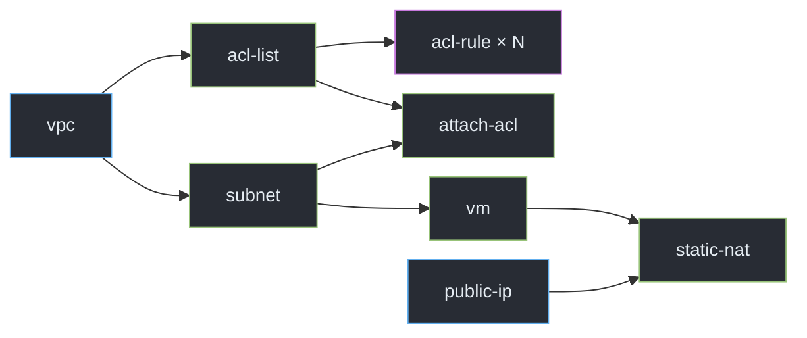

OVERVIEW

# Challenge Problem

❌

✅

<!--
- kita sudah tau problemnya semua, karna ini sudah dijelaskan kemarin, intinya gimana caranya kita handle job ini se-efisien mungkin
- sebenarnya job bisa jalan secara linear, tapi ini nggak efektif. satu job akan menunggu job yang lain
- nah challengenya adalah membuat job tersebut menjadi paralel. kita bisa atur. mana job yang bisa jalan bareng, dan mana job yang harus menunggu terlebih dahulu
- harusnya untuk penyelesaian masalah dari semua tim kurang lebih sama, karna problem yang dikasih juga sama.
- mungkin yang jadi pembeda ada di seberapa banyak fitur, tech stack, dan pertimbangan desain yang dipakai
-->

