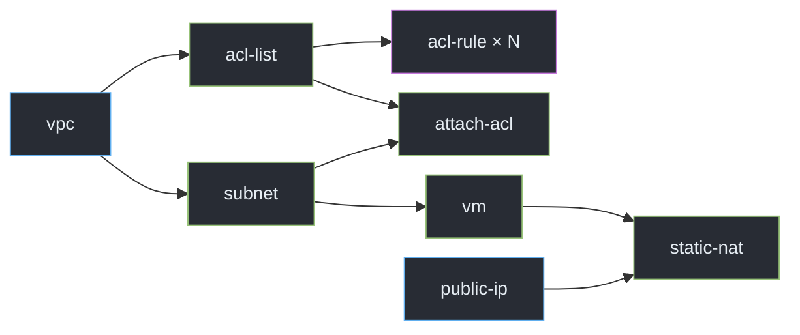

```mermaid 
flowchart LR
    VPC["vpc"]
    SUB["subnet"]
    ACL["acl-list"]
    RULE["acl-rule × N"]
    ATT["attach-acl"]
    VM["vm"]
    IP["public-ip"]
    NAT["static-nat"]

    VPC ~~~ SUB ~~~ ACL ~~~ RULE ~~~ ATT ~~~ VM ~~~ IP ~~~ NAT

    classDef root fill:#282c34,stroke:#e6edf3,color:#e6edf3,stroke-width:1px,font-size:14px;
    classDef work fill:#282c34,stroke:#e6edf3,color:#e6edf3,stroke-width:1px,font-size:14px;
    classDef fan fill:#282c34,stroke:#e6edf3,color:#e6edf3,stroke-width:1px,font-size:14px;

    class VPC,IP root;
    class SUB,ACL,ATT,VM,NAT work;
    class RULE fan;
```

OVERVIEW

# Challenge Problem

```mermaid
flowchart LR
    VPC["vpc"] --> SUB["subnet"]
    SUB --> ACL["acl-list"]
    ACL --> RULE["acl-rule × N"]
    RULE --> ATT["attach-acl"]
    ATT --> VM["vm"]
    VM --> IP["public-ip"]
    IP --> NAT["static-nat"]

    classDef root fill:#282c34,stroke:#61afef,color:#e6edf3,stroke-width:1px,font-size:14px;
    classDef work fill:#282c34,stroke:#98c379,color:#e6edf3,stroke-width:1px,font-size:14px;
    classDef fan fill:#282c34,stroke:#c678dd,color:#e6edf3,stroke-width:1px,font-size:14px;

    class VPC root;
    class SUB,ACL,ATT,VM,IP,NAT work;
    class RULE fan;
```

❌

✅

<!--

[//]: # (- kita sudah tau problemnya semua, karna ini sudah dijelaskan kemarin, intinya gimana caranya kita handle job ini se-efisien mungkin)

[//]: # (- sebenarnya job bisa jalan secara linear, tapi ini nggak efisien. satu job akan menunggu job yang lain)

[//]: # (- nah challengenya adalah membuat job tersebut menjadi paralel. kita bisa atur. mana job yang bisa jalan bareng, dan mana job yang harus menunggu terlebih dahulu)

[//]: # (- harusnya untuk penyelesaian masalah dari semua tim kurang lebih sama, karna problem yang dikasih juga sama.)

[//]: # (- mungkin yang jadi pembeda ada di seberapa banyak fitur, tech stack, dan pertimbangan desain yang dipakai)

Untuk problemnya sendiri sebenarnya kita semua sudah tahu, karena kemarin juga sudah dijelaskan. Jadi intinya adalah **bagaimana caranya kita bisa menjalankan job-job ini seefisien mungkin**.

Sebenarnya semua job bisa saja kita jalankan secara **linear atau berurutan**. Tapi pendekatan seperti itu kurang efisien, karena satu job harus menunggu job sebelumnya selesai, padahal belum tentu keduanya saling bergantung.

Nah, di situlah challenge utamanya, yaitu **bagaimana membuat job-job tersebut bisa berjalan secara paralel**. Kita perlu menentukan mana job yang bisa langsung berjalan bersamaan, dan mana job yang memang harus menunggu job lain selesai karena memiliki dependency.

Selain masalah dependency dan parallel execution, ada satu hal lagi yang perlu kita handle, yaitu **timeout, delay, dan failure**. Karena kita berinteraksi dengan API cloud, prosesnya tidak selalu langsung berhasil. API bisa membutuhkan waktu cukup lama, mengalami timeout, atau bahkan gagal. Jadi kita membutuhkan **mekanisme retry**, baik ketika melakukan polling untuk mengecek hasil job maupun ketika terjadi kegagalan saat menjalankan operasi.

Untuk solusi dari masing-masing tim, menurut saya secara konsep seharusnya kurang lebih akan mirip, karena problem yang kita selesaikan juga sama.

Yang mungkin menjadi pembeda adalah **bagaimana masing-masing tim mengimplementasikan solusinya**, mulai dari seberapa banyak fitur yang dibuat, tech stack yang digunakan, sampai pertimbangan desain dan *trade-off* yang diambil.

NOTE SAJA:

DAG = Directed Acyclic Graph:
- Directed → hubungan punya arah, misalnya `VPC` → `Subnet` → `VM`.
- Acyclic → tidak boleh ada hubungan yang berputar kembali/circular.
- Graph → terdiri dari node dan hubungan antar-node (edge).

Sederhananya: DAG adalah konsep untuk menggambarkan "step mana bergantung pada step mana" tanpa dependency yang berputar.
-->

