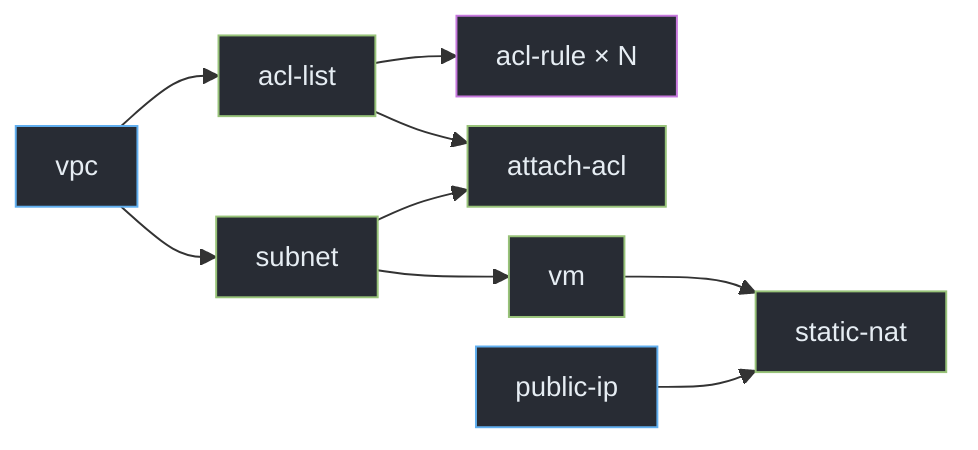
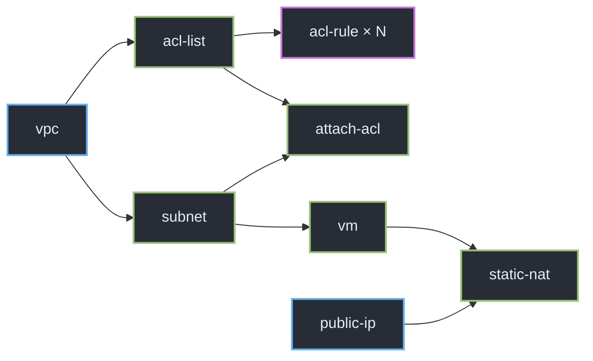

<div class="cover-shell core-cover">
  <div class="eyebrow">TYPE SCRIPT · CORE EXECUTION ENGINE</div>
  <h1>Deployment Job<br><span>Orchestrator</span></h1>
  <p class="lead">Deep dive: bagaimana <code>src/core</code> mengubah deployment intent menjadi DAG runtime, transisi state, retry, dan rollback.</p>
  <div class="cover-pills">
    <span>graph resolution</span><span>concurrent scheduler</span><span>failure recovery</span>
  </div>
</div>

<div class="cover-orbit orbit-a"></div>
<div class="cover-orbit orbit-b"></div>

<!--
Deck ini fokus pada execution engine di src/core. Narasinya selalu: data masuk dalam bentuk apa, diubah oleh modul mana, lalu keluar dalam bentuk apa.dddddd


dfsdf
\sdf

sdf

sdf
s
df
s
dfsdf
s
df
s
df
s
df
s
df
sd
f
sd
ffsdfs

sdfs


sdfsdf
-->

---
layout: two-cols-header
transition: none
---
::left::
```ts
type JobCaseDefinition = {
  jobId: string
  defaults?: {
    config?: { maxTimeout?: number }
  }
  steps: Record<string, JobCaseStep>
}
```

---
layout: two-cols-header
transition: none
---
::left::
```ts
function createDeploymentSteps(client: FakeCloudStackClient) {
    return {
        "vpc":        { dependsOn: [],                     run() {}, rollback() {} },
        "subnet":     { dependsOn: ["vpc"],                run() {}, rollback() {} },
        "acl-list":   { dependsOn: ["vpc"],                run() {} },
        "acl-rule":   { dependsOn: ["acl-list"],           run() {} },
        "attach-acl": { dependsOn: ["subnet", "acl-list"], run() {} },
        "vm":         { dependsOn: ["subnet"],             run() {}, rollback() {} },
        "public-ip":  { dependsOn: [],                     run() {} },
        "static-nat": { dependsOn: ["vm", "public-ip"],    run() {} },
    } 
}
```




```md {1|2-3|4}
| id                            | name          | definition                                                             |
|-------------------------------|---------------|------------------------------------------------------------------------|
| deploy-vm-without-public-ip   | ...           | [vpc, subnet, acl-list, acl-rule, attach-acl, vm]                       |
| deploy-vm-with-public-ip      | ...           | [vpc, subnet, acl-list, acl-rule, attach-acl, vm, public-ip, static-nat] |
| deploy-vpc-with-acl-rules     | ...           | [vpc, acl-list, acl-rule]                                               |
| deploy-vm-with-missing-subnet | ...           | [vpc, acl-list, vm]                                                     |
| deploy-vm-with-unknown-steps  | ...           | [vpc-new, acl-list, vm-new]                                             |
```


```ts {hide|none}
type JobCaseDefinition = {
  jobId: string
  defaults?: {
    config?: { maxTimeout?: number }
  }
  steps: Record<string, JobCaseStep>
}
```


fgh 

```ts
type JobCaseDefinition = {
  jobId: string
  defaults?: {
    config?: { maxTimeout?: number }
  }
  steps: Record<string, JobCaseStep>
}
```

---
layout: default
---

<div class="slide-kicker">01 · CORE MAP</div>

# Core bukan satu loop besar

<div class="core-chain mt-7">
  <div><small>FACADE</small><b>DeploymentOrchestrator</b><span>membuat run</span></div>
  <i>→</i>
  <div><small>PLAN</small><b>buildApiJobGraph</b><span>validasi DAG</span></div>
  <i>→</i>
  <div><small>RESOLVE</small><b>resolveJobCase</b><span>runtime jobs</span></div>
  <i>→</i>
  <div class="focus"><small>CONTROL</small><b>Scheduler</b><span>ready + running</span></div>
  <i>→</i>
  <div><small>ACTION</small><b>JobExecutor</b><span>attempt + timeout</span></div>
</div>

<div class="core-support mt-8">
  <div class="support-line"></div>
  <div><b>rollback.ts</b><span>reverse cleanup setelah failure</span></div>
  <div><b>timeout.ts</b><span>validasi dan konversi unit</span></div>
  <div><b>OrchestratorStore</b><span>boundary persistence untuk snapshot dan transisi</span></div>
</div>

<div class="statement-strip mt-8">
  <span class="dot"></span>
  Setiap modul mempersempit tanggung jawab: <code>intent → plan → runnable state → attempt → recovery</code>.
</div>

<p class="source">Referensi: <code>src/core/deployment-orchestrator.ts:17–117</code>, <code>src/core/api-job-graph.ts:10–61</code>, <code>src/core/job-definition.ts:24–109</code>, <code>src/core/scheduler.ts:9–114</code>, <code>src/core/job-executor.ts:13–151</code></p>

<!--
DeploymentOrchestrator hanya facade. Ia merangkai store, executor, dan scheduler; detail graph, attempt, dan cleanup berada di modul terpisah.
-->

---
layout: two-cols-header
---

<div class="slide-kicker">02 · FACADE</div>

# Satu call mengubah case menjadi hasil run

::left::

<div class="transform-label">INPUT</div>

```ts
type JobCaseDefinition = {
  jobId: string
  defaults?: {
    config?: { maxTimeout?: number }
  }
  steps: Record<string, JobCaseStep>
}
```

<div class="type-caption">Deployment intent · belum executable</div>

<div class="facade-arrow">↓ <span>deployCase()</span></div>

```ts
async deployCase(deploymentCase, jobRunId) {
  const maxTimeout = caseMaxTimeout(deploymentCase)
  const runId = await this.createJobRunFromCase(
    deploymentCase, jobRunId
  )
  return this.runJobRun(runId, maxTimeout)
}
```

::right::

<div class="transform-label after">OUTPUT</div>

```ts
type JobRunResult = {
  jobRun: {
    id: string
    status: JobRunStatus
  }
  jobs: JobStepRunRecord[]
}
```

<div class="type-caption success-caption">State final · siap dibaca UI</div>

<div class="facade-steps">
  <div><b>1</b><span>load stored definition</span></div>
  <div><b>2</b><span>resolve menjadi runtime jobs</span></div>
  <div><b>3</b><span>snapshot ke database</span></div>
  <div><b>4</b><span>jalankan scheduler</span></div>
</div>

<p class="source">Referensi facade: <code>src/core/deployment-orchestrator.ts:56–75, 87–108</code>; tipe: <code>src/types.ts:80–85, 196–199</code></p>

<!--
Facade mengubah representasi dari case configuration menjadi JobRunResult. Di tengahnya ada snapshot persisten, jadi scheduler tidak berjalan langsung dari JSON mentah.
-->

---
layout: two-cols-header
---

<div class="slide-kicker">03 · GRAPH INPUT</div>

# Step ID berubah menjadi graph terurut

::left::

<div class="transform-label">SEBELUM · PILIHAN TEMPLATE</div>

```ts
[
  "vm",
  "attach-acl",
  "acl-rule",
  "subnet",
  "acl-list",
  "vpc"
]
```

<div class="object-note">Hanya logical ID. Urutan input tidak dipercaya sebagai urutan eksekusi.</div>

::right::

<div class="transform-label after">SESUDAH · TOPOLOGICAL PLAN</div>

```ts
[
  { id: "vpc",        dependsOn: [] },
  { id: "subnet",     dependsOn: ["vpc"] },
  { id: "acl-list",   dependsOn: ["vpc"] },
  { id: "vm",         dependsOn: ["subnet"] },
  { id: "attach-acl", dependsOn: ["subnet", "acl-list"] },
  { id: "acl-rule",   dependsOn: ["acl-list"] }
]
```

<div class="object-note good">Dependency selalu muncul lebih dulu daripada dependent.</div>

<div class="merge-order mt-5"><span>selected IDs</span><b>›</b><span>registry metadata</span><b>›</b><span>DFS</span><b>›</b><span>ordered graph</span></div>

<p class="source">Referensi: <code>src/core/api-job-graph.ts:10–23, 25–61</code></p>

<!--
Graph builder mengambil dependency dari deployment-step registry. Template hanya memilih node; registry menentukan edge dan execution mode.
-->

---
layout: default
---

<div class="slide-kicker">04 · GRAPH VALIDATION</div>

# DFS membangun urutan sekaligus menjaga invariant

<div class="dfs-layout mt-6">

```ts
if (visited.has(stepId)) return
if (visiting.has(stepId))
  throw new Error(`cycle detected at: ${stepId}`)

visiting.add(stepId)
for (const dependencyId of step.dependsOn) {
  if (!selected.has(dependencyId)) throw missingDependency()
  visit(dependencyId)
}

visiting.delete(stepId)
visited.add(stepId)
ordered.push({
  id: stepId,
  dependsOn: [...step.dependsOn],
  execution: step.execution,
})
```

<div class="dfs-states">
  <div class="dfs-box yellow"><small>VISITING</small><b>acl-list</b><span>sedang membuka dependency</span></div>
  <div class="dfs-arrow">dependency selesai ↓</div>
  <div class="dfs-box green"><small>VISITED</small><b>vpc</b><span>aman, tidak perlu diproses ulang</span></div>
  <div class="dfs-arrow">post-order push ↓</div>
  <div class="dfs-box blue"><small>ORDERED</small><b>[vpc, acl-list]</b><span>dependency berada di depan</span></div>
</div>

</div>

<div class="guard-row mt-6">
  <span>duplicate ID</span><span>unknown ID</span><span>missing dependency</span><span>cycle</span><span>fan-out dependent</span>
</div>

<p class="source">Kode disederhanakan dari <code>src/core/api-job-graph.ts:14–60</code></p>

<!--
Post-order DFS adalah alasan output topologis: sebuah node baru didorong ke ordered setelah seluruh dependency selesai dikunjungi.
-->

---
layout: default
---

<div class="slide-kicker">05 · GRAPH RUNTIME</div>

# Dependency membuka paralelisme

<div class="graph-stage core-graph mt-3">



</div>

<div class="grid-3 graph-notes mt-3">
  <div><b><code>remaining = 0</code></b><span><code>vpc</code> dan <code>public-ip</code> langsung READY.</span></div>
  <div><b>VPC sukses</b><span><code>subnet</code> dan <code>acl-list</code> dibuka bersamaan.</span></div>
  <div><b>Join</b><span><code>static-nat</code> menunggu dua counter dependency menjadi nol.</span></div>
</div>

<p class="source">Graph metadata: <code>src/requests/deployment-steps.ts:46–260</code>; konsumsi graph: <code>src/core/scheduler.ts:22–35, 88–93</code></p>

<!--
Core graph tidak menyimpan level atau batch. Scheduler menghitung readiness dari jumlah dependency yang belum sukses, sehingga parallelism muncul alami.
-->

---
layout: two-cols-header
---

<div class="slide-kicker">06 · CASE RESOLUTION</div>

# Logical step berubah menjadi runtime job

::left::

<div class="transform-label">SEBELUM</div>

```json
{
  "defaults": { "config": { "maxRetries": 4 } },
  "steps": {
    "acl-rule": {
      "instances": {
        "ssh":  { "input": { "startPort": 22 } },
        "http": { "input": { "startPort": 80 } }
      }
    }
  }
}
```

<p class="source tight">Input case: <code>src/interfaces/cli/cases/03.success-parallel-acl-rules.json:1–102</code></p>

::right::

<div class="transform-label after">SESUDAH</div>

```ts
[
  {
    id: "acl-rule:ssh",
    type: "acl-rule",
    dependsOn: ["acl-list"],
    input: { startPort: 22 },
    maxRetries: 4
  },
  {
    id: "acl-rule:http",
    type: "acl-rule",
    dependsOn: ["acl-list"],
    input: { startPort: 80 },
    maxRetries: 4
  }
]
```

<p class="source tight">Resolver: <code>src/core/job-definition.ts:24–58, 62–109</code></p>

<div class="merge-order mt-4"><span>logical ID</span><b>›</b><span>runtime ID</span><b>›</b><span>independent state</span></div>

<!--
flatMap menghasilkan satu job untuk mode single atau banyak job untuk fan-out-leaf. Type tetap acl-rule agar seluruh instance berbagi handler yang sama.
-->

---
layout: two-cols-header
---

<div class="slide-kicker">07 · CONFIG PRECEDENCE</div>

# Override mengalir dari paling spesifik

::left::

<div class="precedence-stack">
  <div class="p-level p1"><small>1 · INSTANCE</small><b>maxRetries: 1</b><span>nilai paling spesifik</span></div>
  <div class="p-level p2"><small>2 · STEP</small><b>maxRetries: 2</b><span>dipakai bila instance kosong</span></div>
  <div class="p-level p3"><small>3 · CASE DEFAULT</small><b>maxRetries: 4</b><span>default per case</span></div>
  <div class="p-level p4"><small>4 · ORCHESTRATOR</small><b>maxRetries: 0</b><span>fallback saat snapshot dibuat</span></div>
</div>

::right::

```ts
const maxRetries = instance?.config?.maxRetries
  ?? configured.config?.maxRetries
  ?? deploymentCase.defaults?.config?.maxRetries

const maxTimeout = instance?.config?.maxTimeout
  ?? configured.config?.maxTimeout
  ?? deploymentCase.defaults?.config?.maxTimeout

return {
  id: runtimeId,
  type: step.type,
  dependsOn: [...step.dependsOn],
  ...(maxRetries === undefined ? {} : { maxRetries }),
}
```

<div class="resolution-result mt-5"><small>HASIL UNTUK INSTANCE INI</small><b><code>maxRetries = 1</code></b></div>

<p class="source tight">Core resolution: <code>src/core/job-definition.ts:62–109</code>; orchestrator fallback: <code>src/core/deployment-orchestrator.ts:63–73</code></p>

<!--
Nullish coalescing penting: nilai 0 adalah override valid dan tidak boleh dianggap false. Fallback orchestrator baru diterapkan setelah resolver selesai.
-->

---
layout: two-cols-header
---

<div class="slide-kicker">08 · SCHEDULER BOOT</div>

# Definition berubah menjadi indeks runtime

::left::

```ts
[
  { id: "vpc", dependsOn: [] },
  { id: "subnet", dependsOn: ["vpc"] },
  { id: "vm", dependsOn: ["subnet"] }
]
```

<div class="type-caption">JobDefinition[] · bentuk persisten</div>

<div class="facade-arrow compact">↓ <span>scheduler.run()</span></div>

```ts
const definitionsById = new Map(...)
const statuses = new Map(...)
const dependents = new Map(...)
const remaining = new Map(...)
const ready: string[] = []
const running = new Map()
```

::right::

<div class="runtime-indexes">
  <div><small>remaining</small><pre>vpc → 0
subnet → 1
vm → 1</pre></div>
  <div><small>dependents</small><pre>vpc → [subnet]
subnet → [vm]
vm → []</pre></div>
  <div><small>statuses</small><pre>vpc → PENDING
subnet → PENDING
vm → PENDING</pre></div>
  <div class="index-output"><small>ready</small><pre>[vpc]</pre></div>
</div>

<div class="object-note good mt-5"><code>remaining</code> menjawab “berapa dependency belum sukses?” tanpa traversal graph berulang.</div>

<p class="source">Referensi: <code>src/core/scheduler.ts:16–44, 63–67</code></p>

<!--
Scheduler mengubah definisi persisten menjadi beberapa indeks mutable. dependents dipakai untuk bergerak ke depan; remaining dipakai untuk menentukan readiness.
-->

---
layout: default
---

<div class="slide-kicker">09 · CONCURRENCY LOOP</div>

# Ready queue berubah menjadi pekerjaan paralel

<div class="lane-layout mt-6">
  <div class="lane">
    <small>READY QUEUE</small>
    <div class="lane-jobs"><span>subnet</span><span>acl-list</span></div>
  </div>
  <div class="lane-arrow">shift + execute →</div>
  <div class="lane running-lane">
    <small>RUNNING MAP</small>
    <div class="lane-jobs"><span>subnet → Promise</span><span>acl-list → Promise</span></div>
  </div>
  <div class="lane-arrow">Promise.race →</div>
  <div class="lane outcome-lane">
    <small>FIRST OUTCOME</small>
    <div class="lane-jobs"><span>acl-list · SUCCESS</span></div>
  </div>
</div>

<div class="code-explain scheduler-code mt-8">

```ts
while (failedBy === undefined && ready.length > 0) {
  const jobId = ready.shift()!
  const controller = new AbortController()
  const result = executor.execute(jobRunId, jobId, controller.signal)
    .then(outcome => ({ jobId, outcome }))
  running.set(jobId, { controller, result })
}

const { jobId, outcome } = await Promise.race(
  [...running.values()].map(({ result }) => result)
)

for (const dependent of dependents.get(jobId)!) {
  const count = remaining.get(dependent)! - 1
  remaining.set(dependent, count)
  if (count === 0) await enqueue(dependent)
}
```

<div>
  <h3>Incremental, bukan batch</h3>
  <p>Satu job yang selesai langsung membuka dependent-nya. Scheduler tidak menunggu semua job paralel dalam gelombang yang sama.</p>
  <p class="source tight">Referensi: <code>src/core/scheduler.ts:69–93</code></p>
</div>

</div>

<!--
Promise.race membuat scheduler bereaksi pada outcome tercepat. Map running tetap menyimpan promise lain yang belum selesai.
-->

---
layout: default
---

<div class="slide-kicker">10 · EXECUTION CONTEXT</div>

# Job persisten berubah menjadi handler context

<div class="handoff mt-7">
  <div class="handoff-card">
    <small>1 · JOB STEP RECORD</small>
    <pre>{ jobId, type, attempt,
  input, apiControl }</pre>
  </div>
  <div class="handoff-arrow"><span>store lookup</span>→</div>
  <div class="handoff-card">
    <small>2 · DEPENDENCY RESULTS</small>
    <pre>{ vpc: { id: "vpc-42" },
  aclList: { id: "acl-7" } }</pre>
  </div>
  <div class="handoff-arrow"><span>runAttempt</span>→</div>
  <div class="handoff-card accent-border">
    <small>3 · JOB RUN CONTEXT</small>
    <pre>{ jobRunId, jobId, attempt,
  input, dependencyResults,
  signal, sleep }</pre>
  </div>
</div>

<div class="code-explain mt-8">

```ts
return this.handlers[job.type]!.run({
  jobRunId: job.jobRunId,
  jobId: job.jobId,
  attempt: job.attempt,
  input: job.input,
  dependencyResults: await store.getDependencyResults(
    job.jobRunId, job.jobId
  ),
  signal: attemptSignal,
  sleep: ms => sleep(ms, attemptSignal),
})
```

<div>
  <h3>Core tidak mengenal CloudStack</h3>
  <p>Executor hanya memilih handler berdasarkan <code>type</code> dan memberi context generik. Implementasi domain berada di luar core.</p>
  <p class="source tight">Referensi: <code>src/core/job-executor.ts:107–125</code>; kontrak context: <code>src/types.ts:128–155</code></p>
</div>

</div>

<!--
Inilah inversion boundary: core mengatur kapan dan berapa kali handler dipanggil, tetapi tidak mengetahui query atau response API domain.
-->

---
layout: two-cols-header
---

<div class="slide-kicker">11 · RETRY LOOP</div>

# Satu job bergerak lewat state yang persisten

::left::

```ts
while (true) {
  const current = await store.getJobStepRun(jobRunId, jobId)
  const attempt = current.attempt + 1
  const job = await store.transitionJob(jobRunId, jobId, {
    status: "RUNNING", attempt, error: null,
  })

  try {
    const result = await this.runAttempt(job, signal, timeoutMs)
    await store.transitionJob(jobRunId, jobId, {
      status: "SUCCESS", result, error: null,
    })
    return { success: true }
  } catch (error) {
    await store.transitionJob(jobRunId, jobId, {
      status: "FAILED", error: error.message,
    })
    if (signal.aborted || attempt > current.maxRetries)
      return { success: false, error }

    await store.transitionJob(jobRunId, jobId, {
      status: "RETRYING", error: null,
    })
  }
}
```

::right::

<div class="retry-state-flow">
  <div class="r-state run"><small>ATTEMPT 1</small><b>RUNNING</b></div>
  <i>↓ throw</i>
  <div class="r-state fail"><b>FAILED</b><span>error dipersist</span></div>
  <i>↓ attempt ≤ maxRetries</i>
  <div class="r-state retry"><b>RETRYING</b><span>error dibersihkan</span></div>
  <i>↓ next loop</i>
  <div class="r-state success"><small>ATTEMPT 2</small><b>SUCCESS</b><span>result dipersist</span></div>
</div>

<div class="object-note mt-5"><code>maxRetries = 1</code> berarti maksimal <code>2 attempts</code>.</div>

<p class="source tight">Referensi: <code>src/core/job-executor.ts:21–51</code></p>

<!--
FAILED tetap dicatat meskipun akan retry. Karena transisi append-only, histori tetap memperlihatkan semua attempt, bukan hanya state akhir.
-->

---
layout: two-cols-header
---

<div class="slide-kicker">12 · TIMEOUT</div>

# Dua sumber cancellation menjadi satu signal

::left::

<div class="signal-compose">
  <div class="signal external"><small>SCHEDULER</small><b>externalSignal</b><span>abort setelah sibling gagal</span></div>
  <div class="signal-plus">+</div>
  <div class="signal local"><small>EXECUTOR</small><b>controller.signal</b><span>abort ketika timer habis</span></div>
  <div class="signal-equals">↓ AbortSignal.any</div>
  <div class="signal merged"><small>ATTEMPT</small><b>attemptSignal</b><span>dikirim ke handler + sleep + fetch</span></div>
</div>

::right::

```ts
const controller = new AbortController()
const signal = AbortSignal.any([externalSignal, controller.signal])

const timeout = new Promise<never>((_resolve, reject) => {
  timer = setTimeout(() => {
    const error = new Error(`Job ${jobId} timed out`)
    error.name = "TimeoutError"
    controller.abort(error)
    reject(error)
  }, timeoutMs)
})

try {
  return await Promise.race([operation(signal), timeout])
} finally {
  if (timer !== undefined) clearTimeout(timer)
}
```

<div class="object-note good mt-5">Timeout membatasi waktu menunggu attempt; tidak menjamin operasi remote sudah berhenti.</div>

<p class="source tight">Referensi: <code>src/core/job-executor.ts:128–150</code>; unit conversion: <code>src/core/timeout.ts:1–19</code></p>

<!--
Scheduler dan executor punya alasan cancel berbeda. AbortSignal.any menggabungkannya supaya handler menerima satu kontrak cancellation.
-->

---
layout: default
---

<div class="slide-kicker">13 · FAILURE COORDINATION</div>

# Satu failure mengubah seluruh run

<div class="status-transform mt-7">
  <div class="status-side">
    <div class="transform-label">SEBELUM</div>
    <div class="status-list">
      <span><b>vpc</b><i class="s-success">SUCCESS</i></span>
      <span><b>subnet</b><i class="s-failed">FAILED</i></span>
      <span><b>acl-list</b><i class="s-running">RUNNING</i></span>
      <span><b>vm</b><i class="s-pending">PENDING</i></span>
    </div>
  </div>
  <div class="status-arrow">stopAfterFailure("subnet")<br>→</div>
  <div class="status-side">
    <div class="transform-label after">SESUDAH</div>
    <div class="status-list">
      <span><b>run</b><i class="s-failed">FAILED</i></span>
      <span><b>acl-list</b><i class="s-abort">ABORT SIGNAL</i></span>
      <span><b>vm</b><i class="s-skipped">SKIPPED</i></span>
      <span><b>ready queue</b><i class="s-empty">EMPTY</i></span>
    </div>
  </div>
</div>

<div class="code-explain failure-code mt-7">

```ts
failedBy = jobId
await store.setJobRunStatus(jobRunId, "FAILED")

for (const runningJob of running.values())
  runningJob.controller.abort(new Error(`stopped after ${jobId}`))

ready.length = 0
for (const [pendingId, status] of statuses) {
  if (["PENDING", "READY", "RETRYING"].includes(status))
    await store.transitionJob(jobRunId, pendingId, {
      status: "SKIPPED", error: `Blocked by ${jobId}`,
    })
}
```

<div>
  <h3>Failure dikonsolidasikan sekali</h3>
  <p><code>failedBy</code> mencegah failure lain memulai koordinasi kedua saat beberapa promise selesai hampir bersamaan.</p>
  <p class="source tight">Referensi: <code>src/core/scheduler.ts:46–61, 94–96</code></p>
</div>

</div>

<!--
Job sukses tetap dipertahankan untuk fase rollback. Job yang belum mulai ditandai skipped agar state final seluruh DAG eksplisit.
-->

---
layout: two-cols-header
---

<div class="slide-kicker">14 · ROLLBACK ORDER</div>

# Forward success berubah menjadi reverse cleanup

::left::

<div class="transform-label">FORWARD · CREATE</div>

<div class="rollback-sequence forward-seq">
  <span>vpc</span><i>→</i><span>subnet</span><i>→</i><span>vm</span>
</div>

<div class="sequence-status mt-5"><span>SUCCESS</span><span>SUCCESS</span><span>SUCCESS</span></div>

<div class="transform-label after mt-10">REVERSE · CLEANUP</div>

<div class="rollback-sequence reverse-seq">
  <span>destroy vm</span><i>→</i><span>delete subnet</span><i>→</i><span>delete vpc</span>
</div>

<div class="object-note good mt-5">Resource downstream dibersihkan sebelum dependency-nya.</div>

::right::

```ts
await store.setJobRunStatus(jobRunId, "ROLLING_BACK")

const rollbackCandidates = new Set(
  (await store.getJobStepRuns(jobRunId))
    .filter(({ status }) =>
      ["SUCCESS", "ROLLING_BACK", "ROLLBACK_FAILED"].includes(status))
    .map(({ jobId }) => jobId)
)

let failed = false
for (const job of [...ordered].reverse()) {
  if (rollbackCandidates.has(job.id)
      && !(await executor.rollback(jobRunId, job.id))) {
    failed = true
  }
}

await store.setJobRunStatus(
  jobRunId, failed ? "ROLLBACK_FAILED" : "ROLLED_BACK"
)
```

<p class="source tight">Referensi: <code>src/core/rollback.ts:7–35</code></p>

<!--
Rollback tidak berhenti ketika satu cleanup gagal. Ia terus mencoba parent lain lalu mengagregasi hasil menjadi status akhir run.
-->

---
layout: two-cols-header
---

<div class="slide-kicker">15 · ROLLBACK ATTEMPT</div>

# Rollback punya lifecycle dan retry sendiri

::left::

<div class="retry-state-flow rollback-flow">
  <div class="r-state run"><small>ROLLBACK ATTEMPT 1</small><b>ROLLING_BACK</b></div>
  <i>↓ handler throws</i>
  <div class="r-state fail"><b>ROLLBACK_FAILED</b><span>error dipersist</span></div>
  <i>↓ attempt ≤ maxRollbackRetries</i>
  <div class="r-state run"><small>ROLLBACK ATTEMPT 2</small><b>ROLLING_BACK</b></div>
  <i>↓ handler resolves</i>
  <div class="r-state success"><b>ROLLED_BACK</b></div>
</div>

::right::

```ts
const initial = await store.getJobStepRun(jobRunId, jobId)
const rollback = handlers[initial.type]?.rollback

if (rollback === undefined) {
  await transition("ROLLING_BACK")
  await transition("ROLLBACK_SKIPPED")
  return true
}

while (true) {
  const current = await store.getJobStepRun(jobRunId, jobId)
  const attempt = current.rollbackAttempt + 1
  const job = await transition("ROLLING_BACK")

  try {
    await withTimeout(() => rollback({
      attempt, input: job.input, result: job.result,
    }))
    await transition("ROLLED_BACK")
    return true
  } catch (error) {
    await transition("ROLLBACK_FAILED", error)
    if (attempt > current.maxRollbackRetries) return false
  }
}
```

<div class="object-note mt-5">Attempt eksekusi dan rollback dihitung terpisah.</div>

<p class="source tight">Kode disederhanakan dari <code>src/core/job-executor.ts:54–105</code></p>

<!--
Handler rollback menerima result dari forward run. Ini penting karena ID resource yang akan dihapus baru diketahui setelah create sukses.
-->

---
layout: default
---

<div class="slide-kicker">16 · PERSISTENCE BOUNDARY</div>

# Core menulis event, store membangun state

<div class="persistence-bridge mt-7">
  <div class="bridge-side core-side">
    <small>SRC / CORE</small>
    <b>transition intent</b>
    <pre>{ status: "RUNNING", attempt: 2 }
{ status: "FAILED", error: "timeout" }
{ status: "RETRYING", error: null }
{ status: "SUCCESS", result: {...} }</pre>
  </div>
  <div class="bridge-center">
    <span>transitionJob()</span>
    <i>→</i>
    <span>getJobStepRun()</span>
    <i>←</i>
  </div>
  <div class="bridge-side store-side">
    <small>DATABASE / STORE</small>
    <b>append-only history</b>
    <pre>#12 · RUNNING  · attempt 2
#13 · FAILED   · timeout
#14 · RETRYING · null
#15 · SUCCESS  · result {...}</pre>
  </div>
</div>

<div class="rebuild-flow mt-8">
  <span>ordered logs</span><i>→</i><span>group by jobId</span><i>→</i><span>latest state + timing</span><i>→</i><strong>JobStepRunRecord</strong>
</div>

<div class="statement-strip mt-7">
  <span class="dot purple"></span>
  Executor dan scheduler selalu membaca ulang state persisten; retry tidak hanya hidup di memory proses.
</div>

<p class="source">Call site core: <code>src/core/job-executor.ts:28–49</code>, <code>src/core/scheduler.ts:38–43</code>; implementasi store: <code>src/database/store.ts:210–272, 300–339</code></p>

<!--
Core mengirim transition intent, bukan memutasi object state lokal sebagai sumber kebenaran. Store merekonstruksi state dari histori.
-->

---
layout: default
---

<div class="slide-kicker">17 · END-TO-END TRACE</div>

# Satu deployment melintasi tujuh transformasi

<div class="trace-flow mt-7">
  <div><small>01</small><b>JobCaseDefinition</b><span>deployment intent</span></div><i>→</i>
  <div><small>02</small><b>JobDefinition[]</b><span>resolved snapshot</span></div><i>→</i>
  <div><small>03</small><b>Runtime indexes</b><span>remaining + dependents</span></div><i>→</i>
  <div><small>04</small><b>Ready / Running</b><span>concurrent control</span></div>
</div>

<div class="trace-flow second mt-5">
  <div><small>05</small><b>JobRunContext</b><span>handler boundary</span></div><i>→</i>
  <div><small>06</small><b>Transition logs</b><span>persistent evidence</span></div><i>→</i>
  <div><small>07</small><b>JobRunResult</b><span>final observable state</span></div>
</div>

<div class="core-file-map mt-9">
  <div><b>Facade</b><code>deployment-orchestrator.ts</code></div>
  <div><b>Graph</b><code>api-job-graph.ts</code></div>
  <div><b>Resolve</b><code>job-definition.ts</code></div>
  <div><b>Control</b><code>scheduler.ts</code></div>
  <div><b>Attempt</b><code>job-executor.ts</code></div>
  <div><b>Recovery</b><code>rollback.ts</code></div>
  <div><b>Timeout</b><code>timeout.ts</code></div>
</div>

<p class="source">Seluruh modul utama: <code>src/core/</code></p>

<!--
Penutup: orchestration di sini dapat dipahami sebagai rangkaian transformasi data dan transisi state, bukan sekadar urutan pemanggilan API.
-->

---
layout: center
class: summary-slide
---

<div class="slide-kicker centered">TAKEAWAY</div>

# Core mengubah<br><span>intent menjadi state yang dapat dipercaya</span>

<div class="takeaway-flow mt-10">
  <div><b>Validate</b><span>graph invariant</span></div><i>→</i>
  <div><b>Resolve</b><span>runtime jobs</span></div><i>→</i>
  <div><b>Schedule</b><span>parallel safely</span></div><i>→</i>
  <div><b>Recover</b><span>retry + rollback</span></div>
</div>

<p class="summary-copy mt-10">Graph memastikan urutan. Scheduler membuka paralelisme. Executor mengisolasi attempt. Persistence menjaga histori. Rollback mengembalikan konsistensi.</p>

<div class="end-tag mt-8">Deployment Job Orchestrator · src/core deep dive</div>

<!--
Simpulkan dalam empat kata kerja: validate, resolve, schedule, recover.
-->
