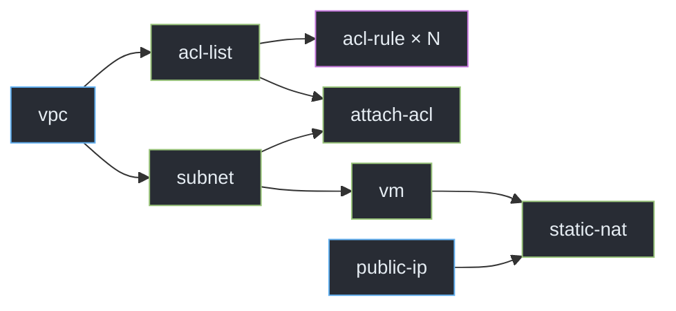

---
layout: two-cols-header
transition: none
---
::left::

```mermaid
%%{init: {
  "themeVariables": {
    "fontSize": "14px"
  },
  "flowchart": {
    "nodeSpacing": 15,
    "rankSpacing": 40,
    "padding": 10
  }
}}%%

flowchart LR
    VPC["vpc"] --> SUB["subnet"]
    VPC --> ACL["acl-list"]
    ACL --> RULE["acl-rule × N"]
    SUB --> ATT["attach-acl"]
    ACL --> ATT
    SUB --> VM["vm"]
    IP["public-ip"] --> NAT["static-nat"]
    VM --> NAT

    classDef root fill:#282c34,stroke:#61afef,color:#e6edf3,stroke-width:1px,font-size:14px;
    classDef work fill:#282c34,stroke:#98c379,color:#e6edf3,stroke-width:1px,font-size:14px;
    classDef fan fill:#282c34,stroke:#c678dd,color:#e6edf3,stroke-width:1px,font-size:14px;

    class VPC,IP root;
    class SUB,ACL,ATT,VM,NAT work;
    class RULE fan;
```