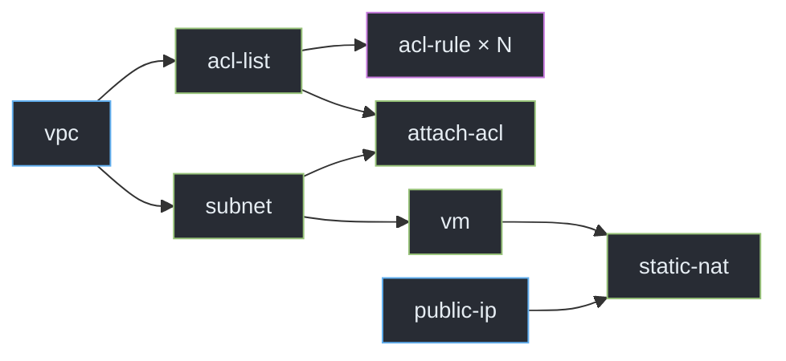

::left::

---
layout: default
---

PROJECT CAPABILITIES

# Fitur Utama Project

  

    <h3>Orchestration</h3>
    <ul>
      <li><b>DAG-based scheduling</b> untuk menjaga urutan dependency antar-job.</li>
      <li><b>Parallel execution</b> untuk job independen yang sudah siap dijalankan.</li>
      <li><b>Named instances / fan-out</b> untuk mengeksekusi beberapa ACL rule secara paralel.</li>
      <li><b>Definition validation</b> untuk dependency hilang, step tidak dikenal, dan cycle.</li>
    </ul>
  

  

    <h3>Reliability & Operations</h3>
    <ul>
      <li><b>Retry dan timeout</b> yang dapat diatur per case, step, maupun instance.</li>
      <li><b>Automatic rollback</b> dalam urutan terbalik ketika deployment gagal.</li>
      <li><b>Persistent audit trail</b> melalui SQLite dan append-only status log.</li>
      <li><b>Interactive CLI & 11 demo cases</b> untuk success, failure, retry, dan rollback.</li>
    </ul>
  

  
  Satu flow mencakup <strong>validasi → eksekusi → retry → rollback → persistence</strong>.

---
layout: default
---

NEXT ITERATION

# Kekurangan & Peluang Improvement

  

    <h3>Reliability & Scale</h3>
    <ul>
      <li><b>Belum ada resume otomatis</b> untuk melanjutkan run setelah process crash atau restart.</li>
      <li><b>Concurrency belum dibatasi</b>; seluruh job ready dapat berjalan sekaligus.</li>
      <li><b>Retry masih sederhana</b>; perlu exponential backoff, jitter, dan klasifikasi error.</li>
      <li><b>Masih single-process + SQLite</b>; belum siap untuk distributed worker dan high availability.</li>
    </ul>
  

  

    <h3>Product & Maintainability</h3>
    <ul>
      <li><b>Observability terbatas</b>; belum ada metrics, tracing, alerting, atau dashboard.</li>
      <li><b>Fan-out masih leaf-only</b>; hasil instance belum dapat menjadi dependency step berikutnya.</li>
      <li><b>Integrasi masih berupa fake API</b>; perlu hardening untuk auth, idempotency, dan error nyata.</li>
      <li><b>Interface hanya CLI</b>; API atau web UI akan memudahkan monitoring dan operasi tim.</li>
    </ul>
  

  <b>Prioritas berikutnya:</b> crash recovery, concurrency limit, lalu production observability.

